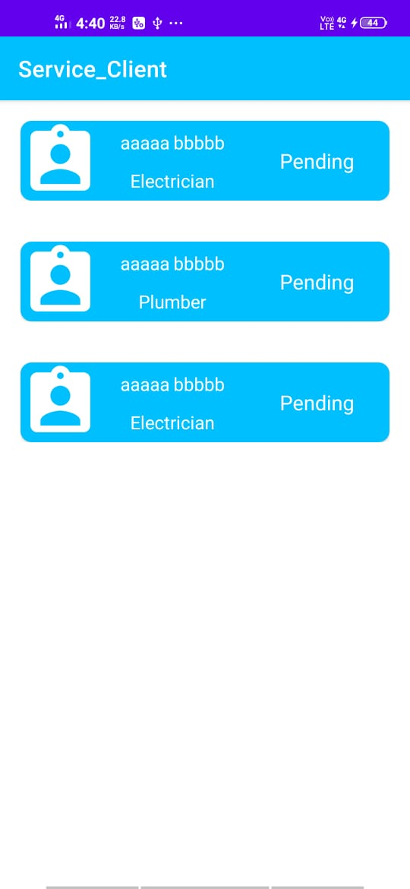

# Service Milegi Server

### About
Client interface of the Service Milegi App which can be used by app client to manage services.

### Contributor
Roshan Wazare <https://github.com/Rosh008>

### App Features
  * Home screen displays the services availed by users at any given time.
  * Client has a option to confirm booking for the placed service.
  * Service is Marked as Completed in the user's app in realtime when client confirms booking.
  * User details are displayed to the client.
  
### Libraries Used
  * Same as user App (git link here)
  
  
### Concepts Covered
  * Same as user App (git link here)
